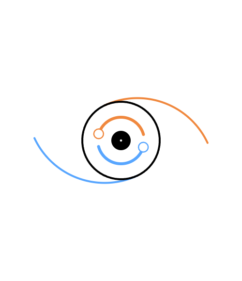

<p align="center">
  
</p>
<p align="right">
    <b>English</b> | <a href="README.md">中文</a>
</p>

<h1 align="center" id="title">s9y (Singularity)</h1>

<p align="center">
  <b>Recursive Delegation Protocol</b><br>
  <i>Two primitives, infinite leverage</i>
</p>

<p align="center">
  <a href="#philosophy">Philosophy</a> •
  <a href="#features">Features</a> •
  <a href="https://github.com/lazier334/open-s9y-auto" target="_blank">open-s9y-auto</a>
</p>

---

## What is the relationship between s9y, open-s9y, and open-s9y-auto?
**`open-s9y`** is a foundational implementation of the **`s9y protocol`**.  
<a href="https://github.com/lazier334/open-s9y-auto" target="_blank">open-s9y-auto</a> is an extension of <a href="https://github.com/lazier334/open-s9y" target="_blank">open-s9y</a>.

## What is s9y?

s9y is not just another API gateway. It is an **organizational protocol** composed of two primitives:

- **`register(capabilities)`** — "I exist and can be employed"
- **`push(task)`** — "Execute this task"

These two primitives are sufficient to express arbitrary recursive delegation networks: AI agents, human organizations, biological systems, or IoT clusters.

## Quick Start with open-s9y
1. Ensure <a href="https://nodejs.org/" target="_blank">NodeJs</a> is installed
2. [Download repository code](https://github.com/lazier334/open-s9y/archive/refs/heads/main.zip) (You can also use <a href="https://git-scm.com/install/windows" target="_blank">Git</a> or other tools to pull the code: `git clone https://github.com/lazier334/open-s9y`)
3. Use the terminal to start the program: `npm start`

---

## <a id="philosophy" href="#title">Philosophy: Why Singularity? Why Pivot?</a>

### Singularity

s9y refers to a **structural singularity**:

> When a set of communication primitives (`register` / `push`) can uniformly describe everything from 1B parameter models to civilizations of 7 billion people, from neurons to automotive ECUs, **the complexity of the rules no longer grows with the scale of the system** — it remains exactly 2 actions.

In other words, the **cost** of describing any system no longer depends on how large the system is, but on whether these primitives can capture its essential interactions. After crossing this threshold, control equations from different domains are unified, and previously disparate phenomena can be modeled using the same language.

| Domain                | Before s9y                         | After s9y           |
| --------------------- | ---------------------------------- | ------------------- |
| AI Engineering        | OpenAI API / LangChain / AutoGen   | `register` + `push` |
| Social Simulation     | NetLogo / MASON proprietary syntax | `register` + `push` |
| IoT Control           | MQTT / CoAP / HTTP mixed usage     | `register` + `push` |
| Distributed Computing | RPC / Message Queues / Serverless  | `register` + `push` |
 
**The true singularity is not "one model does everything," but "all systems can finally speak the same language."**

### Pivot

Archimedes said: "Give me a lever long enough and a fulcrum on which to place it, and I shall move the world."

A physical fulcrum requires three conditions:
1. **Rigidity** — No deformation, so force can be transmitted
2. **Locatability** — Knowing where the fulcrum is
3. **Load-bearing capacity** — Able to withstand the pressure of the lever

s9y's pivot corresponds:

| Physical Fulcrum | s9y Pivot                                                                                                                   |
| ---------------- | --------------------------------------------------------------------------------------------------------------------------- |
| **Rigidity**     | **Minimal completeness** of the two primitives — neither added nor removed, the protocol semantics remain rigidly unchanged |
| **Locatability** | Unique identifier + capability declaration at `register` time — I know where this pivot is and what it can do               |
| **Load-bearing** | The contract of `push` — I can place a task on it, and it must respond                                                      |

> **Pivot** is the Minimal Employable Unit in the s9y system. It constitutes a lever point because (1) it keeps protocol semantics rigidly unchanged, (2) it is located through capability registration, and (3) it can bear delegated tasks without exposing internal implementation to the employer (recursive opacity).

### Recursive Leverage: Infinite Extension

Archimedes' lever requires **a single fixed fulcrum**. s9y allows **recursive fulcrums** — each pivot can itself become a lever, employing smaller pivots.

```
Earth (problem)
  │
  └─ Lever ──→ Brain pivot (fulcrum)
                   │
                   └─ Lever ──→ Code pivot (fulcrum)
                                    │
                                    └─ Lever ──→ Syntax checking pivot (fulcrum)
```

**Every level is a fulcrum, and every level leverages the next.**

This is not physical infinity, but **capability coverage multiplication through recursive delegation**:
- A 3B parameter "brain" pivot can coordinate ten 7B expert pivots
- Each 7B pivot can delegate to ten 1B tool pivots
- The total schedulable parameter count reaches **173B**, but at any moment only the parameters on the maximum path are active (e.g., 3+7+1=11B) — **achieving large-scale capability coverage while maintaining lightweight execution**.

---

## <a id="features" href="#title">Features</a>

### Pluggable Transport Layer

- **In-memory communication** — In-process function calls (zero-copy, zero-latency)
- **HTTP** — RESTful delegation across containers or nodes
- **WebSocket** — Bidirectional streaming, progress push, long-lived sessions
- **Others** — Anything that can transmit

All modes share **the same set of primitives**. The transport layer is replaceable without modifying business logic.

---

### What s9y Does NOT Do

The power of a minimal protocol comes from **restraint**:

1. **No consensus / consistency guarantees** — Conflict arbitration is the brain's responsibility
2. **No real-time hard synchronization** — Nanosecond-level synchronization requires an additional time protocol layer
3. **No value judgments** — Ethics and legality are the organization's responsibility

These boundaries are not defects, but **design choices**. It is precisely because we do not stuff these into the protocol that s9y can be applied to such a wide range of domains. For full functionality, please use the <a href="https://github.com/lazier334/open-s9y-auto" target="_blank">open-s9y-auto</a> project.

---

## License

MIT License — See [LICENSE](LICENSE) for details.