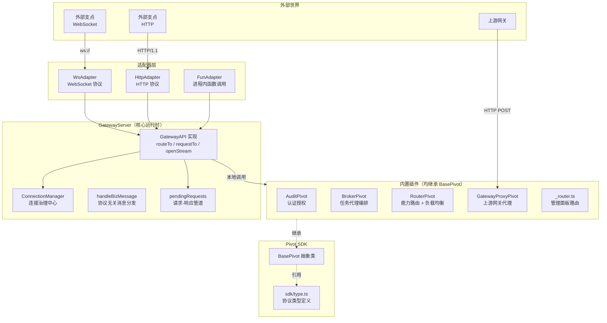
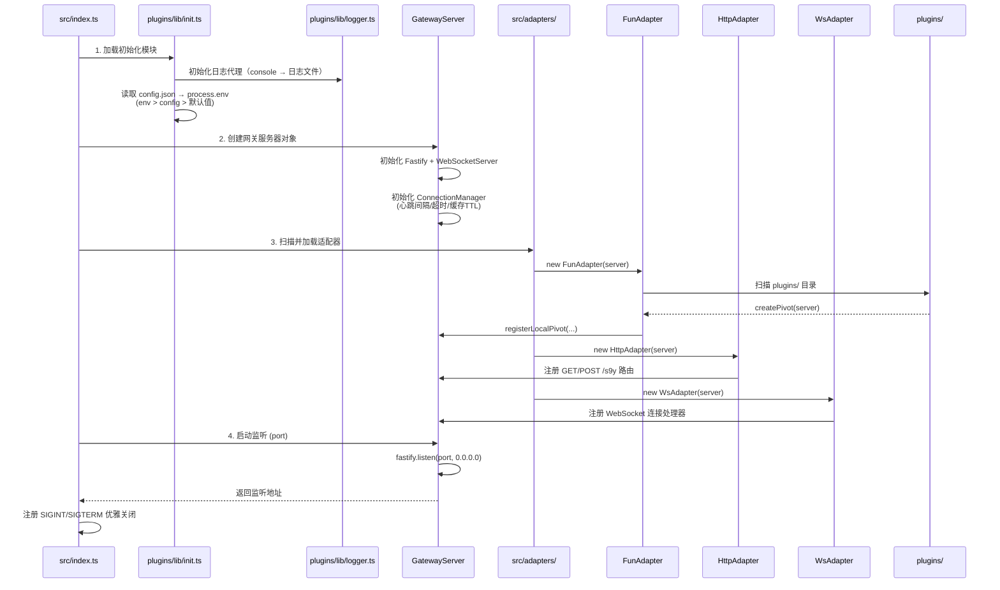
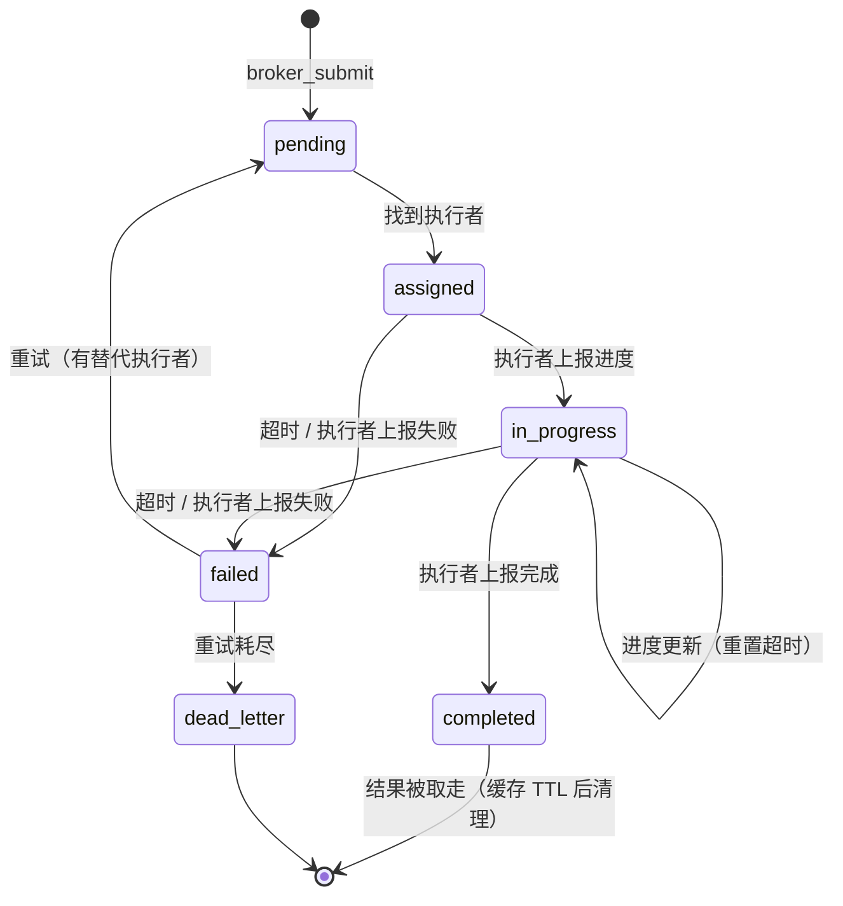

# open-s9y

这是一个网关系统，用于构建单体或多体组织。

- **单体**：一个事物
- **多体组织**：一个群体或多个群体

<!-- 以下是用不同粒度的“支点”接入同一个奇点的例子 -->
- 可以用细分概念「手、脚、脑」来代表一个[支点](#pivot-支点)，此时多个具体事物接入一个[奇点](#s9y-奇点)，这时的奇点就是一个单体/个体。
- 可以用常见概念「人」来代表一个[支点](#pivot-支点)，此时多个人接入一个[奇点](#s9y-奇点)，这时的奇点就是一个组织。
- 可以用庞大概念「组织」来代表一个[支点](#pivot-支点)，此时多个组织接入一个[奇点](#s9y-奇点)，这时的奇点就是一个多体组织/世界。

---

## 快速开始

1. 确保已安装 [Node.js](https://nodejs.org/) >= 24
2. 下载当前仓库
3. 运行 `npm start`
4. 访问日志上的地址

::: tip 开发模式
使用 `npm run dev` 启动开发模式，支持插件热重载（每 2 秒扫描一次 `plugins/` 目录）。
:::

---

## 配置

> 相关文件：[config.json](../../config.json)

配置文件 `config.json` 会在启动时由 `plugins/lib/init.ts` 加载到 `process.env` 中。优先级为：**环境变量 > config.json > 代码默认值**。

### 全部可配置项

| 配置项                   | 类型      | 默认值                                 | 说明                                           |
| ------------------------ | --------- | -------------------------------------- | ---------------------------------------------- |
| `GATEWAY_PORT`           | `number`  | `10000`                                | 网关 HTTP 服务监听端口                         |
| `GATEWAY_LOG_PATH`       | `string`  | `logs/<时间戳>.log`                    | 日志文件路径。CLI 参数 `LOG_PATH` 优先级更高   |
| `GATEWAY_CMD`            | `string`  | `npm run gateway`                      | 重启时执行的命令（`API_SHUTDOWN=true` 时有效） |
| `API_SHUTDOWN`           | `boolean` | `false`                                | 是否暴露 `/shutdown` 和 `/restart` 端点        |
| `API_ADMIN`              | `boolean` | `false`                                | 是否开启管理面板（`/index.html`）              |
| `API_CONFIG`             | `boolean` | `false`                                | 是否允许通过 API 在线修改配置                  |
| `AUDIT_KEY_NAME`         | `string`  | `s9y-key`                              | 认证 Cookie / URL 参数名                       |
| `AUDIT_AUTH_KEYS`        | `string`  | `user,agent,system,gateway,tool,other` | 允许的认证密钥列表（逗号分隔）                 |
| `AUDIT_PIVOT_ID`         | `string`  | `audit-01`                             | 审计插件的支点 ID                              |
| `BROKER_PIVOT_ID`        | `string`  | `broker-01`                            | 任务代理插件的支点 ID                          |
| `BROKER_DEFAULT_TIMEOUT` | `number`  | `30000`                                | 任务默认超时（毫秒）                           |
| `BROKER_MAX_RETRIES`     | `number`  | `3`                                    | 任务最大重试次数                               |
| `BROKER_RESULT_TTL`      | `number`  | `36000000`                             | 结果缓存有效期（毫秒，默认 10 小时）           |
| `PLUGIN_PIVOT_ID`        | `string`  | `router-01`                            | 插件路由的支点 ID（GatewayServer 构造参数）    |

::: warning 安全提示
生产环境中请将 `AUDIT_AUTH_KEYS` 替换为真实认证机制（如 JWT / OAuth2），当前仅做简单的白名单匹配。
:::

---

## 框架

open-s9y 使用可组装模式，绝大部分模块均可单独替换。

### 系统架构



### 启动阶段

> 相关文件：[src/index.ts](../../src/index.ts)



### 模块名词概念

#### s9y：奇点
当前整个网关系统。

#### GatewayServer：网关服务器对象

> 相关文件：[src/server.ts](../../src/server.ts)

约等于是整个[奇点](#s9y-奇点)的核心运行时，实现 `GatewayAPI` 接口：

| 方法                                 | 说明                                     |
| ------------------------------------ | ---------------------------------------- |
| `routeTo(pivotId, message)`          | 向指定支点推送消息（异步）               |
| `requestTo(pivotId, message)`        | 向指定支点请求并等待响应（返回 Promise） |
| `openStream(pivotId, message)`       | 请求流式数据                             |
| `registerLocalPivot(pivotId, pivot)` | 注册进程内支点                           |
| `getAllPivots()`                     | 获取所有在线支点信息                     |
| `handleBizMessage(message)`          | 协议无关的业务消息统一入口               |
| `listen(port)`                       | 启动 HTTP 服务器（支持端口重试）         |
| `close()`                            | 优雅关闭                                 |

**关键内部字段：**

- `pendingRequests: Map<traceId, PendingRequest>` — 请求-响应管道，适配器通过 `traceId` 将响应回传
- `completedTasks: Set<string>` — 已完成任务集合
- `pipeWaiters: Map<taskId, PipeWaiter>` — 管道等待者（长轮询）

#### ConnectionManager：连接治理中心

> 相关文件：[src/connection.ts](../../src/connection.ts)

统一管理所有支点连接，提供以下能力：

- **活跃连接管理** — 维护 WS / HTTP 长轮询连接的 Map
- **心跳检测** — 定时 ping + 超时断开（仅 WS）
- **断线缓存** — 支点断开后缓存其信息（TTL 内重连可恢复状态）
- **任务路由表** — `taskId → pivotId` 映射，断连自动清理
- **本地支点管理** — 进程内插件的注册与移除
- **网络认证** — 委托 AuditPivot 进行连接认证

关键配置（通过 `GatewayServerOptions` 传入）：

| 参数                | 默认值     | 说明                 |
| ------------------- | ---------- | -------------------- |
| `heartbeatInterval` | `30000` ms | 心跳发送间隔         |
| `pivotTimeout`      | `60000` ms | 支点心跳超时断开阈值 |
| `pivotCacheTTL`     | `60000` ms | 断线缓存的生存时间   |

#### Adapters：接入适配器

> 相关文件：[src/adapters/](../../src/adapters/)

open-s9y 会扫描 `src/adapters/` 文件夹内的所有 `.ts`/`.js` 文件，识别名称以 `Adapter` 结尾的类并全部创建实例，创建时传入 [GatewayServer](#gatewayserver-网关服务器对象) 实例。

适配器是用于提供[奇点](#s9y-奇点)内部、外部[支点](#pivot-支点)通信的桥梁。

| 适配器          | 文件              | 作用                                                                               |
| --------------- | ----------------- | ---------------------------------------------------------------------------------- |
| **WsAdapter**   | `ws-adapter.ts`   | WebSocket 长连接：处理握手、心跳、register 消息、业务消息分发与响应回传            |
| **HttpAdapter** | `http-adapter.ts` | HTTP 协议：`GET /s9y` 长轮询注册，`POST /s9y` 消息推送（混合 query+body 参数合并） |
| **FunAdapter**  | `fun-adapter.ts`  | 进程内调用：扫描 `plugins/` 目录动态加载本地支点，支持热重载                       |

::: info 协议统一
三种适配器最终都调用 `server.handleBizMessage(message)`，实现**协议无关**的业务消息处理。无论支点通过何种方式接入，消息路由逻辑完全一致。
:::

#### Pivot：支点

- 所有能通过 [Adapters](#adapters-接入适配器) 接入[奇点](#s9y-奇点)的均称为支点。
- 仅实现 `register` 或 `push` 的也是支点（非标准支点），例如通过 `curl` 向奇点发送一个 HTTP 请求，此时 `curl` 也被视作一个支点。
- 在奇点内的支点一般称为[插件](#plugins-插件)。

**支点分类：**

| 类型      | 通信方式                 | 说明                               |
| --------- | ------------------------ | ---------------------------------- |
| 本地支点  | FunAdapter（进程内调用） | 内置插件，如 Broker、Router、Audit |
| WS 支点   | WebSocket 长连接         | 支持心跳、双向通信、进度推送       |
| HTTP 支点 | HTTP 长轮询              | 适用于无法维持 WebSocket 的环境    |
| 临时支点  | 单次 HTTP POST           | 如 curl 发送消息，不持久连接       |

#### Plugins：插件

- 插件不仅仅是[支点](#pivot-支点)。大部分情况下插件就是支点，少数情况下插件不是支点（如 `_router.ts` 注册的是 Fastify 路由钩子而非支点逻辑）。
- 插件是[奇点](#s9y-奇点)的内部程序——就像脚是人的一个支点，车也可以是人的一个支点，但脚与人是深度耦合的。

**约定：** 每个插件文件（不以 `_` 开头）需导出 `createPivot(server: GatewayServer): BasePivot` 工厂函数。

**内置插件一览：**

| 插件                  | 文件                     | 支点 ID         | 能力                        | 说明                                                                  |
| --------------------- | ------------------------ | --------------- | --------------------------- | --------------------------------------------------------------------- |
| **AuditPivot**        | `audit-pivot.ts`         | `audit-01`      | `audit`                     | 认证与授权：验证 Cookie/URL 参数白名单，审查连接合法性                |
| **BrokerPivot**       | `broker-pivot.ts`        | `broker-01`     | `broker`, `broker:progress` | 任务代理：生命周期管理（状态机）、容错重试、结果缓存（TTL）、合规检测 |
| **RouterPivot**       | `router-pivot.ts`        | `router-01`     | `routing`                   | 默认路由：能力匹配 + 最小负载均衡，`targetName` 模糊匹配              |
| **GatewayProxyPivot** | `gateway-proxy-pivot.ts` | `gateway-proxy` | 动态                        | 上游网关代理：将任务转发给其他 s9y 网关实例                           |
| **_router.ts**        | `_router.ts`             | -               | -                           | 管理面板路由钩子（`preHandler` 认证 + `/admin/api/status` 等 API）    |

#### Pivot SDK：支点开发套件

> 相关文件：[sdk/base-pivot-sdk.ts](../../sdk/base-pivot-sdk.ts) | [sdk/type.ts](../../sdk/type.ts)

SDK 提供两个核心模块，用于便捷开发新的支点：

**1. `BasePivot`（抽象类）** — 所有支点的基类，封装了与网关通信的通用逻辑：

- **双传输模式** — WebSocket 长连接 或 HTTP 长轮询，通过 `useWebSocket` 选项切换
- **自动注册** — 连接时自动发送 `register` 消息（含 `pivotId`、`type`、`capabilities` 等）
- **心跳管理** — WS 模式下自动定时发送心跳
- **localMode** — 进程内模式，不建立网络连接，供本地插件使用
- **统一 API** — `push()` / `progress()` / `result()` / `status()`
- **抽象方法** — `onTask(message): Promise<unknown>` 必须由子类实现以处理任务

**2. 类型定义** — 完整协议类型：

```ts
// 核心消息结构
interface Message {
  senderId: string           // 发送方支点 ID
  targetId?: string          // 目标支点 ID（精确匹配，优先级最高）
  targetName?: string        // 目标支点名称（模糊匹配，RouterPivot 处理）
  type: MessageType          // "push" | "register" | "heartbeat" | "pivots" | 自定义
  payload: MessagePayload    // 任务数据、能力标签、状态等
  traceId: string            // 全链路追踪 ID
  timestamp: number          // 时间戳
}

interface BasePivotOptions {
  gatewayUrl: string         // 网关地址
  pivotId: string            // 支点唯一标识
  type: PivotType            // "user" | "agent" | "system" | "gateway" | "tool" | "other"
  name?: string              // 支点自定义名称（用于路由匹配）
  capabilities?: string[]    // 能力标签
  useWebSocket?: boolean     // 是否使用 WS（默认 true）
  localMode?: boolean        // 本地模式（跳过网络连接）
  heartbeatInterval?: number // 心跳间隔（默认 30000ms）
}
```

**编写一个自定义支点示例：**

```ts
import { BasePivot } from "open-s9y/sdk/base-pivot-sdk.ts"
import type { Message } from "open-s9y/sdk/type.ts"

class MyPivot extends BasePivot {
  async onTask(message: Message): Promise<unknown> {
    console.log("收到任务:", message.payload)
    // 处理任务逻辑
    return { result: "done" }
  }
}

const pivot = new MyPivot({
  gatewayUrl: "localhost:10000",
  pivotId: "my-worker-01",
  type: "agent",
  capabilities: ["text-processing"],
})
await pivot.connect()
```

---

## 消息协议

### 消息类型

| 类型        | 说明                                                   |
| ----------- | ------------------------------------------------------ |
| `register`  | 支点注册：声明 `pivotId`、`type`、`capabilities`       |
| `heartbeat` | 心跳保活（WS 模式）                                    |
| `push`      | 任务推送 / 业务消息                                    |
| `pivots`    | 查询在线支点列表（可按 `capabilities` 过滤）           |
| 自定义      | 如 `authenticateRequest`、`auditConnection` 等内部通信 |

### 路由规则

当消息到达 `handleBizMessage()` 时：

1. 若 `message.targetId` 存在 → 直接路由到指定支点
2. 若无 `targetId` → 委派给 `pluginPivotId`（默认 `RouterPivot`）进行能力匹配路由
3. `RouterPivot` 的匹配策略：
   - 有 `targetName` → 优先匹配同名支点
   - 否则 → 纯能力匹配 + 最小负载均衡（`assignedCount`）

### 同步与异步

- `payload.sync = true` → 网关等待目标支点响应后直接返回（适合非合规执行者）
- `payload.sync` 未设置 → 网关接受后立即返回 `{ status: "accepted" }`（适合合规执行者，通过 `broker:progress` 上报进度）

### Pipe 协议

用于查询任务进度/结果/状态：

- `GET /pipe?taskId=xxx&protocol=progress` → 获取进度流
- `GET /pipe?taskId=xxx&protocol=result` → 获取任务结果
- `GET /pipe?taskId=xxx&protocol=status` → 获取任务状态

---

## 管理面板 API

> 相关文件：[plugins/_router.ts](../../plugins/_router.ts)

当 `API_ADMIN=true` 时可用。

| 端点                | 方法 | 说明                                                      |
| ------------------- | ---- | --------------------------------------------------------- |
| `/` `/index.html`   | GET  | 管理面板页面（自动设置认证 Cookie）                       |
| `/admin/api/status` | GET  | 获取系统状态（支点列表 / 活跃任务 / 终端任务 / 缓存结果） |
| `/admin/api/config` | GET  | 读取当前配置                                              |
| `/admin/api/config` | POST | 在线修改配置（需 `API_CONFIG=true`）                      |
| `/shutdown`         | GET  | 优雅关机（需 `API_SHUTDOWN=true`）                        |
| `/restart`          | POST | 重启网关（需 `API_SHUTDOWN=true`）                        |

---

## 任务生命周期

BrokerPivot 管理的任务状态机：



---

## 测试

> 相关文件：[tests/](../../tests/)

| 文件                   | 说明                                                                    |
| ---------------------- | ----------------------------------------------------------------------- |
| `test-tasks.ts`        | Broker E2E 测试（6 个场景：happy / dead / caps / cache / result / get） |
| `test-tasks-worker.ts` | 合规测试执行者（支持分步进度上报 0% → 33% → 66% → 100%）                |
| `test-auth.ts`         | 认证测试（HTTP Cookie + WebSocket 双向）                                |

--- 启动方式 ---

先启动网关 `npm run dev`，再运行测试脚本：

```bash
node --experimental-strip-types tests/test-tasks.ts
```

---

## 目录结构

```
open-s9y/
├── config.json              # 运行时配置
├── package.json             # 项目清单（Node >=24, ESM）
├── .env / .env.development  # 环境变量
├── src/
│   ├── index.ts             # 入口：加载配置 → 创建 GatewayServer → 加载适配器 → 启动
│   ├── server.ts            # GatewayServer：核心运行时 + GatewayAPI 实现
│   ├── connection.ts        # ConnectionManager：连接治理 + 任务路由表 + 本地支点管理
│   └── adapters/
│       ├── fun-adapter.ts   # FunAdapter：扫描 plugins/ 动态加载本地支点（热重载）
│       ├── http-adapter.ts  # HttpAdapter：GET/POST /s9y HTTP 协议适配
│       └── ws-adapter.ts    # WsAdapter：WebSocket 协议适配
├── sdk/
│   ├── base-pivot-sdk.ts    # BasePivot 抽象类：所有支点的基类 SDK
│   └── type.ts              # 协议类型定义
├── plugins/
│   ├── audit-pivot.ts       # 认证授权插件
│   ├── broker-pivot.ts      # 任务代理编排插件
│   ├── router-pivot.ts      # 能力路由 + 负载均衡插件
│   ├── gateway-proxy-pivot.ts # 上游网关代理插件
│   ├── _router.ts           # 管理面板路由钩子
│   ├── index.html           # 管理面板 UI
│   └── lib/
│       ├── init.ts          # 配置加载器
│       └── logger.ts        # 日志代理（console → 文件）
└── tests/
    ├── test-tasks.ts        # Broker 端到端测试
    ├── test-tasks-worker.ts # 测试执行者
    └── test-auth.ts         # 认证测试
```
